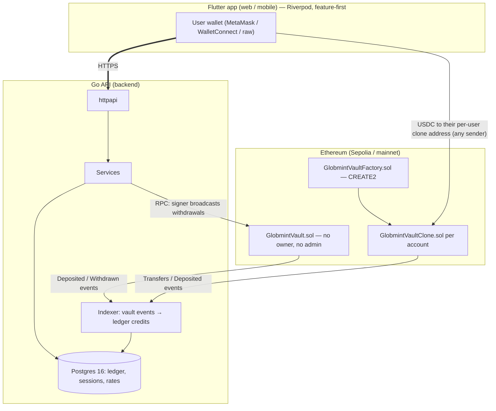
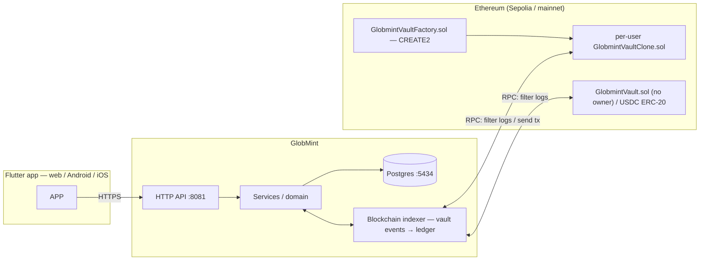
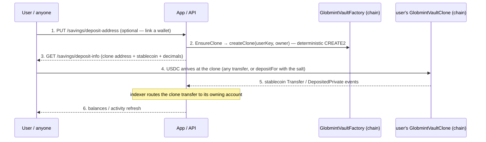
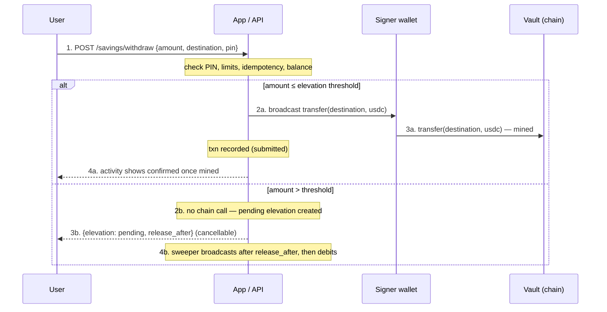
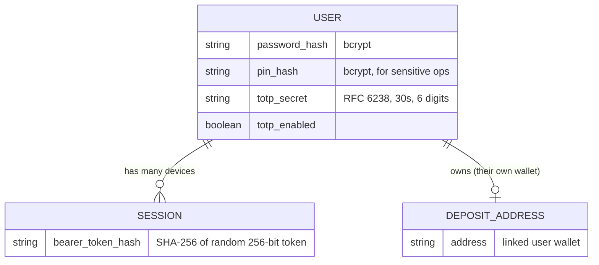
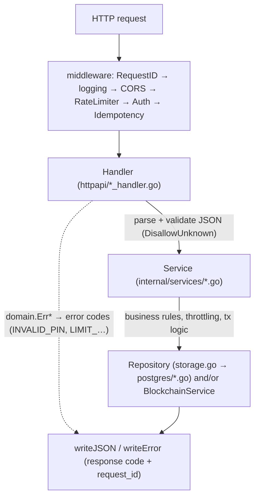
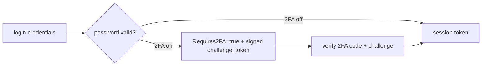
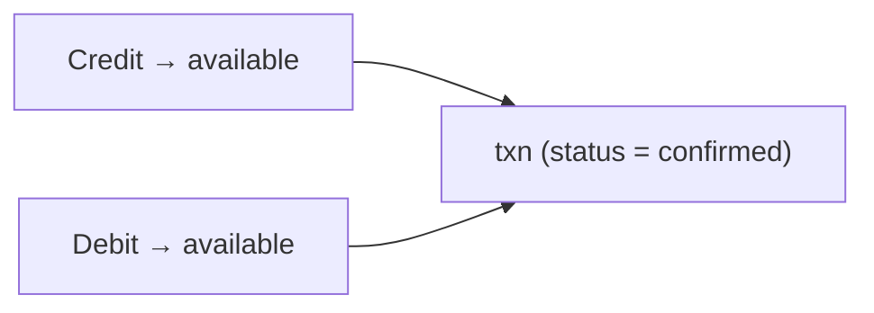
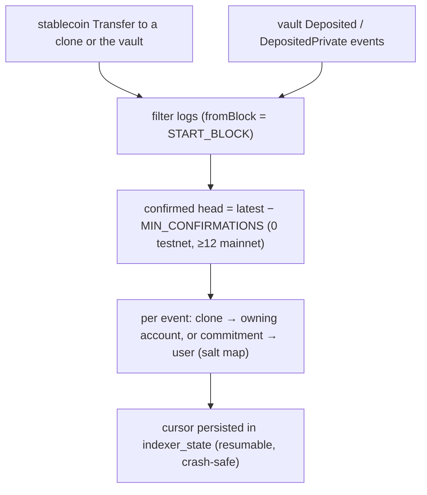
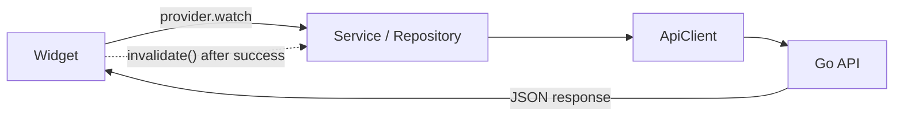

# GlobMint

**Self-custodial, stablecoin savings and payments on Ethereum — no banks, no fiat rails.**

GlobMint is a full-stack fintech product that lets users hold and move money entirely in
USD-backed stablecoins (USDC) through a non-custodial smart-contract vault. There is no
Paystack, no Flutterwave, no local-bank integration: money-in is USDC arriving at a
**per-user vault clone address** (deployed deterministically by a factory, so every account
has its own private on-chain address — no wallet "connect" is ever needed to receive),
and money-out is the user telling the app which address to pay. The platform is a
Go API + Solidity vault + Flutter client, currently live on **Sepolia testnet** and staged
for Ethereum mainnet.



---

## Table of contents

1. [What it is](#1-what-it-is)
2. [System architecture](#2-system-architecture)
3. [Technology stack](#3-technology-stack)
4. [Repository layout](#4-repository-layout)
5. [Domain model](#5-domain-model)
6. [Backend architecture](#6-backend-architecture)
7. [Security](#7-security)
8. [Money, ledger and FX](#8-money-ledger-and-fx)
9. [Blockchain & the vault](#9-blockchain--the-vault)
10. [Frontend architecture](#10-frontend-architecture)
11. [Data model (Postgres migrations)](#11-data-model-postgres-migrations)
12. [Deployment](#12-deployment)
13. [Observability](#13-observability)
14. [Testing & CI](#14-testing--ci)
15. [Operations runbooks](#15-operations-runbooks)
16. [Known boundaries & roadmap](#16-known-boundaries--roadmap)

---

## 1. What it is

GlobMint is a product decision made deliberately: **self-custodial crypto only**.

- Deposits and balances live **on-chain**, each account in its own `GlobmintVaultClone`
  (deterministic EIP-1167 proxy, deployed by `GlobmintVaultFactory`) plus the legacy shared
  `GlobmintVault`. None of them has an owner/admin who can seize, freeze, or move a user's
  USDC.
- The backend is an **indexer + ledger + intent service**. It watches for stablecoin
  transfers into per-user clones and the vault's `Deposited`/`DepositedPrivate` events,
  credits the user's internal ledger so the UI can show balances, and relays withdrawal
  *intents* to the chain. A withdrawal intent is authorized by the **user's own wallet**
  with an EIP-712 signature over `WithdrawRequest(to, amount, nonce, deadline)` — the
  platform signer relays the exact signed call and cannot move funds the user did not sign
  for (§2.3.1). Each clone also supports a **recovery address**: a time-locked fallback
  that can take over ownership if the user loses their wallet key (§9.3.2).
- The app has **no fiat off-ramp built in**. Users withdraw USDC to any address they name —
  their own wallet, or an OTC desk / off-ramp provider that accepts USDC. Fiat conversion
  happens outside GlobMint entirely.

This README is the architectural reference: how the pieces fit, how money flows, and how to
operate it safely — especially the mainnet path where real funds move.

---

## 2. System architecture

### 2.1 High-level topology



Three actors move money:

| Actor | Role |
|---|---|
| **User wallet** | The only party that can *spend*. Deposits do not need it: any wallet, exchange, or friend can send USDC to the user's clone address. |
| **GlobmintVaultClone (per-user)** | One EIP-1167 minimal proxy per account, deployed deterministically via CREATE2. Holds that account's USDC; withdrawing requires the clone owner or a per-withdrawal EIP-712 signature. |
| **GlobmintVaultFactory** | Deploys every account's clone at a deterministic address derived from the account ID and applies the fleet privacy policy (`initialPrivacy`) at deploy time. |
| **GlobmintVault (shared)** | Legacy ownerless vault, kept for API exposure and privacy-event scanning. No admin functions. |
| **Signer wallet** | Server-side key that broadcasts withdrawal transactions *the user requested* and pre-approved with their PIN. Only sends to addresses the user named. |

### 2.2 Deposit flow (money in)



1. The user may link their own wallet address (`PUT /savings/deposit-address`); linking is
   **not** required to receive.
2. On first `deposit-info` the backend deploys the account's clone via `createClone(userKey,
   owner)` — CREATE2 makes the address deterministic, so `predict(userKey)` never changes.
   The `user_vault_clones` row maps clone → account.
3. `GET /savings/deposit-info` returns the **per-user clone address** (plus stablecoin +
   decimals) — the address the app shows for "Add money".
4. Any amount of USDC sent to that address is a deposit: a plain ERC-20 transfer from any
   wallet needs no approval, and privacy clones also accept `depositFor(user, salt, amount)`.
5. The **indexer** sees the stablecoin `Transfer(to == clone)` and — only after the
   confirmation window — credits the clone's owning account. Privacy `DepositedPrivate`
   events from the shared vault are resolved through the `keccak256(user, salt)` commitment
   map.
6. The UI refreshes balances and activity.

### 2.2.1 Deposit flow limitations — direct transfers ("Send")

A user occasionally bypasses the app flow and sends USDC straight to their deposit address
with a generic wallet "Send", or a third party funds it on their behalf. Two facts matter:

- **ERC-20 has no receiver hook.** A standard `transfer`/`send` only updates the token's own
  storage; it never calls the destination contract (exchange into placeholders: `fallback()`
  is not invoked and `Deposited` is not emitted), so the contract **cannot** revert or credit
  such a transfer. Only native ETH is rejected — `receive()` reverts, since with no owner
  stray ETH would be unrecoverable.
- **Any direct send to a per-user clone is credited automatically.** Every account has its
  own clone deposit address, and the indexer routes any stablecoin `Transfer(to == clone)`
  to that clone's owning account — **no wallet link is needed to receive**. This is why the
  app can show a deposit address and let a friend, an exchange, or a brand-new wallet fund it
  without any "connect your wallet" ceremony. Privacy is handled by the accounting, not by
  exposing the mapping: the clone address on chain reveals no personal data (see §5.4).

For the remaining case — a direct send from a wallet **no account is linked to** — the indexer
no longer drops it silently:

1. The transfer is durably flagged as `unattributed` in `indexer_events` (idempotent on
   `(tx_hash, log_index)`), visible to support:

   ```
   GET  /api/v1/operator/vault/unattributed-deposits   # X-Operator-Token: …
   POST /api/v1/operator/vault/attribute-deposit       # {tx_hash, log_index, user_id}
   ```

2. `attribute-deposit` links the sender address to the target user (rejecting a sender that
   belongs to someone else with a conflict) and credits the ledger with the same idempotency
   key the indexer would have used, so replaying the attribution or a later rescan never
   double-credits.
3. Operators authenticate with the `GLOBMINT_OPERATOR_TOKEN` header; both endpoints are
   disabled when that env var is unset.

Operators reconcile the whole ledger on-chain via `vault.vaultAvailableBase()`: the difference
`vaultAvailableBase() - totalDeposits()` is exactly the custody that has not yet been credited
(e.g. stray direct sends still awaiting attribution).

### 2.3 Withdrawal flow (money out)



Safety checks before any chain call: valid address (`ValidateDepositAddress`), PIN verify
(throttled), amount within `MIN/MAX` and the UTC daily cap (`SumWithdrawalsSince`,
principal only — fees never consume the cap), idempotency key replay protection,
`WithdrawEnabled` flag, a user-sufficiency check covering principal + fee, and a
chain-sufficiency pre-check against the vault's on-chain USDC balance. Every rejection
happens without spending gas or touching the chain. Amounts above the elevation
threshold never broadcast immediately — they wait out the time-lock in §9.3.1 instead,
with the fee stored on the row and debited only at sweep time. In the self-custody
(`GLOBMINT_REQUIRE_USER_SIGNATURE=true`) path every amount is additionally gated by the
user's own EIP-712 signature, see §2.3.1.

### 2.3.1 Signature-gated withdrawals — the user signs, the signer relays

In the self-custody path (required by the mainnet gate, §7.5) **no amount leaves the
user's clone unless that user's wallet signed it**:

1. `GET /savings/withdraw/prepare?destination=…&amount=…` runs the same validation as the
   real withdrawal and returns the exact EIP-712 payload to sign: the domain
   (`GlobmintVault` v1, chain id, verifying contract = the user's clone), the message
   (`to`, `amount` in stablecoin base units, the clone's current **nonce**, a ~30-minute
   `deadline`), plus the NGN/fee figures for the review screen. Nothing moves, nothing is
   persisted.
2. The client signs `WithdrawRequest(to, amount, nonce, deadline)` in the user's wallet
   (`eth_signTypedData_v4`) and submits it with `POST /savings/withdraw`.
3. The backend verifies the 65-byte signature off-chain — it must recover to the clone's
   current owner and be unexpired — then relays the **exact** `withdrawWithSig` call to the
   user's clone. The platform signer broadcasts the transaction but cannot re-sign or
   mutate the intent; the clone contract re-checks the signature, nonce, and deadline
   on-chain.

Accounts whose clone owner is still the platform-signer **placeholder** (never claimed)
must first "sign to take custody": the owner's `transferOwnershipBySig` signature moves the
owner seat to the user's wallet. Until then, signed withdrawals and recovery designation
are refused with `SIGNATURE_REQUIRED` (`ErrWithdrawRequiresCustody`). The client gates
signed withdrawals on this precondition — offering the custody claim sheet instead of a
doomed signature — and re-quotes after the handover so the next `Sign & Withdraw` covers
the bumped nonce (the claim is idempotent, so a CONFLICT replay reads as already claimed).
In the transitional `GLOBMINT_REQUIRE_USER_SIGNATURE=false` mode the platform placeholder
owner may still sign on behalf of unclaimed accounts; the production gate requires the
strict mode so that transitional path is unreachable on mainnet.

---

## 3. Technology stack

| Layer | Technology | Notes |
|---|---|---|
| API | **Go 1.24** (`net/http` stdlib mux + middleware chain) | No heavyweight web framework; layered handlers over a shared `Deps` struct. |
| Storage | **PostgreSQL 16** (Docker) + **pgx/v5** | All state (ledger, sessions, rates, users, audit) in one DB. |
| Contracts | **Solidity ^0.8.24**, **Hardhat** + ethers v6 | `GlobmintVault.sol`, `GlobmintVaultV2.sol`, plus `GlobmintVaultClone.sol` + `GlobmintVaultFactory.sol` (OZ-v5 clone construction vendored in the factory — zero-OpenZeppelin build). |
| Chain client | **go-ethereum v1.17** (`rpc`, `ethclient`, `crypto`) | Filter-logs indexer + `SendTransaction`. |
| Client | **Flutter** (`flutter_riverpod`, `go_router`, `freezed`, `http`) | Web + Android/iOS targets; `build/web` served locally. |
| Infra | `docker-compose.yml` (Postgres), bash scripts | Backup, wallet generation, deploy scripts. |
| CI | **GitHub Actions** (`.github/workflows/ci.yml`) | Backend build/vet/test, hardhat test, flutter analyze/build. |
| Observability | Prometheus text format (`/metrics`), `/health` | Pure-Go counters; no agent required. |

---

## 4. Repository layout

```
globe-mint/
├── lib/                          # Flutter client
│   ├── app/                      # app.dart, providers.dart, router.dart
│   ├── core/                     # theme, enums, widgets, network, errors, utils
│   ├── features/
│   │   ├── auth/                 # welcome, login (2FA step), register, PIN, verify
│   │   ├── home/                 # dashboard, balance card, quick actions
│   │   ├── pay/                  # transfer, send-to-beneficiary, bank/OTC transfer
│   │   ├── savings/              # savings page, add money, withdraw, review, vault status
│   │   ├── activity/             # transaction list + filters
│   │   ├── notifications/
│   │   └── profile/              # security center (2FA), change PIN/password, beneficiaries
│   └── shared/
│       ├── models/               # freezed models (User, Transaction, Beneficiary, …)
│       └── services/             # api_client + per-feature API clients
├── backend/
│   ├── cmd/
│   │   ├── server/               # HTTP server entrypoint
│   │   ├── gentestwallet/        # keypair generator + .env verification
│   │   ├── usdcsend/             # raw USDC transfer CLI (dev/OPS)
│   │   └── verifychain/          # on-chain sanity checks (vault/permissions)
│   └── internal/
│       ├── config/               # env parsing + mainnet production gate
│       ├── domain/               # types, errors, money arithmetic
│       ├── httpapi/              # handlers, DTOs, middleware, router
│       ├── infrastructure/       # blockchain (indexer, signer), rates provider
│       ├── observability/        # metrics registry + server
│       ├── services/             # business logic (auth, ledger, money, vault, totp)
│       └── storage/
│           ├── storage.go        # repository interfaces
│           └── postgres/         # pgx implementations + migrations 0001..0018
├── backend/contracts/
│   ├── contracts/                # GlobmintVault.sol, GlobmintVaultV2.sol,
│   │                             # GlobmintVaultClone.sol, GlobmintVaultFactory.sol
│   ├── scripts/                  # deploy.js, devsetup.js, devdepositor.js, devcreditclones.js
│   ├── test/                     # hardhat tests (61 passing: V1 / V2 privacy / clone suite
│   │                             # incl. signature-gated withdrawals + recovery address)
│   └── DEPLOYMENT.md             # full deploy + mainnet runbook
├── scripts/backup.sh             # pg_dump + retention (Docker-aware)
├── .github/workflows/ci.yml
├── .env.example
└── docker-compose.yml            # Postgres 16 on :5434
```

---

## 5. Domain model

The core entities live in `backend/internal/domain`.

### 5.1 Users & sessions



Sessions are **server-side**: a random bearer token is hashed and stored; `Auth` middleware
resolves it per request. Revoking a session (e.g. after a password change) kills that device.

### 5.2 Accounts & the ledger

Accounts are per-user NGN accounts (`available` and `savings`) plus implicitly the on-chain
USDC vault balance. Every balance mutation is a double-entry-style **transaction row**:

```
Transaction(id, type, status, from_account, to_account, amount_minor,
            fee_minor, provider_ref, idempotency_key, created_at, …)
```

`status` spans `initiated → authorized → processing → submitted → confirmed`, or
`failed / cancelled / expired / reversed`. `type` includes `deposit, withdrawal, transfer,
conversion, fee, adjustment, reversal`.

### 5.3 Money arithmetic

`domain/money` wraps `int64` minor units (kobo / raw units) with a strict `Money` type:
no floats, no negative balances, ratio multiplication that rounds deterministically
(`MulRatioRounds`), and a correct `String()` for display. Unit tests cover rounding and
negatives.

### 5.4 Privacy model

Privacy is enforced at the contract level in two complementary layers:

**Per-user clone addresses (the default deposit path).** Every account gets its own
on-chain deposit address — an EIP-1167 minimal proxy deployed by `GlobmintVaultFactory`
via CREATE2 from a per-user key (`keccak256(userID)`, never the owner). A clone address on
chain is just a hash of `(factory, userKey)`: looking it up reveals no personal data, and
because each account has a unique address, no shared contract exposes "who owns what". Anyone
can send USDC to a clone without the recipient ever connecting a wallet — the indexer credits
the clone's owning account by construction.

**Commitment-based balances (privacy mode, `GLOBMINT_PRIVACY_MODE=true`).** When privacy
mode is on, clones (and the V2 vault) store balances against `keccak256(abi.encodePacked(
user, salt))` commitments instead of raw addresses, and only commitment hashes appear in
emitted events (`DepositedPrivate` / `WithdrawnPrivate`). A per-user random 16-byte `salt`
is generated on first deposit-address link and stored in the `user_salts` table, so an
external observer cannot query a balance or correlate a deposit with an identity even if
they know the account's address. The factory sets the privacy flag fleet-wide at deploy time
(`initialPrivacy`); in privacy mode a clone's raw `deposit()` / `withdraw()` /
`withdrawWithSig()` revert, leaving `depositFor` → `withdrawWithSalt` (salt-proving) as the
only funded entry points.

Both keyings coexist in the contracts for zero-downtime migration: raw balances
(`_balances` / `_owners` + token custody) and commitment balances (`_privateBalances`) are
disjoint mappings, so flipping the flag changes which API is usable without touching stored
funds. In legacy mode commitments are a no-op; in privacy mode the backend routes all
balance reads and deposit resolution through the commitment path (`vaultCommitment` in
`backend/internal/services/vault.go`).

---

## 6. Backend architecture

### 6.1 Layers and request lifecycle



- **Handlers** are thin: decode with `DisallowUnknownFields()`, call exactly one service,
  map domain errors to HTTP via `respond.go`, and never touch SQL.
- **Services** hold the business rules and compose repositories + the blockchain client.
  They take `context.Context` and return domain errors.
- **Repositories** are interfaces in `storage/storage.go`, implemented with pgx in
  `storage/postgres`. This is what lets integration tests hit a real Postgres.

### 6.2 HTTP API surface (all prefixed `/api/v1`)

| Group | Routes |
|---|---|
| Auth | `POST /auth/register`, `POST /auth/login`, `POST /auth/logout`, `POST /auth/password`, `POST /auth/2fa/verify`, `GET/POST /auth/totp/{setup,enable,disable}` |
| Users | `GET /users/me` |
| PIN | `POST /pin/verify`, `PUT /pin` |
| Balances | `GET /balances` |
| Transactions | `GET /transactions` |
| Money | `POST /money/deposit`, `withdraw`, `transfer`, `convert`, `quote` |
| Savings/Vault | `GET /savings/deposit-info`, `PUT /savings/deposit-address`, `GET /savings/vault-status`, `GET /savings/custody` (clone owner-seat snapshot; chain-authoritative, cache fallback), `GET /savings/custody/prepare?new_owner=…` (quotes the `TransferOwnership` EIP-712 payload), `POST /savings/custody/claim` (idempotent; relays the custody handover signed by the platform signer), `GET /savings/withdraw/prepare` (quotes the EIP-712 payload to sign), `POST /savings/withdraw` (relays the signed `withdrawWithSig`), `GET /savings/withdraw` (pending time-locks), `POST /savings/withdraw/{id}/cancel`, `GET /savings/recovery` (clone recovery state; chain-authoritative, cache fallback), `GET /savings/recovery/prepare?recovery_address=…` (quotes the `SetRecovery` payload to sign), `PUT /savings/recovery` (relays the signed `setRecoveryAddressBySig`) |
| Beneficiaries | `GET/POST /beneficiaries`, `PATCH /beneficiaries/{id}`, `POST …/favorite`, `DELETE …/{id}`, `GET /beneficiaries/address/{address}` |
| Bank accounts | `GET/POST /bank-accounts`, `POST /bank-accounts/{id}/default`, `DELETE …/{id}` |
| Devices / security | `GET /devices`, `POST /devices/revoke-others`, `POST /devices/{id}/revoke`, `GET /security-events` |
| Notifications | `GET /notifications` |
| Realtime | `GET /events` (Server-Sent Events, Bearer auth) |
| Ops | `GET /health`, `GET /live`, `GET /metrics` |

**SSE (`GET /events`)** pushes balance/vault/transaction invalidation to connected clients
instead of UI polling. On (re)connect the server sends a `connected` frame, then a small
`data.changed` event per `kind` (`account` | `vault` | `transactions` | `all`) whenever a
deposit, withdrawal, transfer, conversion, or vault hold mutates state. A 25-second
heartbeat keeps proxies from dropping the stream; a publish with no subscribers is a no-op.
The Flutter client reconnects with exponential backoff (1s → 15s).

**Withdraw response shape.** `POST /savings/withdraw` returns 201 with either an instant
result (`{transaction, tx_hash}`) or a time-locked one (`{elevation: {id, destination,
amount_ngn_minor, status, release_after, broadcast_tx_hash?}}`) — see §9.3.1. Clients
must handle both shapes; a `pending` elevation is cancellable until `release_after`.

### 6.3 Middleware chain (run order)

1. **RequestID** — assigns/echoes a `request_id`, derived with a salt so it can't be spoofed.
2. **Logging** — method, path, status, duration, request_id.
3. **CORS** — allowlist from `GLOBMINT_CORS_ORIGINS`; `*` = allow all (dev), explicit
   origin list for production; answers preflight `OPTIONS` with 204. Allowed headers
   cover `Content-Type, Authorization, Idempotency-Key, x-access-token` plus
   `Cache-Control`, which the browser EventSource client sends on the SSE stream
   (`no-cache` keeps proxies from buffering events).
4. **RateLimiter** — per-IP token bucket (`clientIPKey` strips the ephemeral port so bursts
   count across a browser session). Applied to login, register, 2FA-verify, PIN verify,
   and money endpoints. Default burst buckets: 5 (auth) / 20 (money), overridable via
   `GLOBMINT_RATE_LIMIT_AUTH_BURST` / `GLOBMINT_RATE_LIMIT_MONEY_BURST`.
5. **Auth** — resolves the bearer token to a `User` (or rejects) for protected routes.
6. **Idempotency** — reads `X-Idempotency-Key` so transfers/withdrawals/deposits replay
   exactly once.

A **Chaos** middleware sits outermost and is off by default. When the server is started with
`GLOBMINT_CHAOS_FAILURE_RATE` and/or `GLOBMINT_CHAOS_LATENCY_MAX_MS`, it injects
HTTP 503s and/or bounded latency on a random fraction of requests — used by load testing to
prove the API degrades cleanly under real faults.

### 6.4 Error model

`domain.Err*` constants carry a canonical code + default message + HTTP status:

| Domain error | Code | HTTP |
|---|---|---|
| `ErrInvalidCredentials` | `INVALID_CREDENTIALS` | 401 |
| `ErrInvalidPIN` | `INVALID_PIN` | 400 |
| `ErrTwoFactorRequired` | `TWO_FACTOR_REQUIRED` | 200 (challenge) |
| `ErrTwoFactorInvalid` | `INVALID_CODE` | 400 |
| `ErrTooManyAttempts` | `TOO_MANY_ATTEMPTS` | 429 |
| `ErrLimitExceeded` | `LIMIT_EXCEEDED` | 403 |
| `ErrFeatureDisabled` | `FEATURE_DISABLED` | 403 |
| `ErrInvalidAmount` | `INVALID_REQUEST` | 400 |
| `ErrUnauthenticated` | `UNAUTHENTICATED` | 401 |

Every error response includes `request_id`; unmapped internal errors are logged
server-side and returned as `INTERNAL` (500).

### 6.5 API conventions

**Request shape.** All bodies are strict JSON. `decodeJSON` uses
`DisallowUnknownFields()`, so a misspelled field name is a real `INVALID_REQUEST` —
never a silent no-op. Currency amounts travel either as **decimal strings** (`"10.50"`)
in request bodies or as **integer minor units** in responses (`amount_minor: 1050000`
for ₦10,500.00). The client parses these with a single formatter; no floats are ever
used for money.

**Response envelope.** Success payloads are bare JSON objects (`{"token": …, "user": …}`
or `{"balances": […]}`). Money spinners (quotes) nest under a `quote` object with
`input_amount`, `output_amount`, `rate`, `reverse_rate`, `fee_bps`, `fee_amount` and
`expires_at`, so clients can show a preview before a user commits.

**Errors.** Consistent triple: `{"code": "SNAKE_CASE", "message": "human string",
"request_id": "…"}`. The client surfaces `message` to the user verbatim and uses `code`
for control flow (e.g. `TWO_FACTOR_REQUIRED` triggers the second login step; `
TOO_MANY_ATTEMPTS` pauses attempts).

**Idempotency.** Money-mutating endpoints accept `X-Idempotency-Key`. A seen key returns
the already-recorded transaction, making client retries safe after network blips.

**Pagination & filtering.** `GET /transactions` supports type/status filters and
cursor-style pagination; the activity screen renders status badges in six switch sites
covering the entire status enum (including `expired`, `reversed`).

### 6.6 Walking one endpoint: `POST /money/transfer`

```
Client:  {"amount": "5000", "currency": "NGN", "to_kind": "savings",
          "idempotency_key": "uuid-123"}
  1. middleware.RequestID/logging/CORS/Auth ──► user resolved from bearer token
  2. Idempotency ──► key "uuid-123" seen? return prior txn, done.
  3. handleTransfer: decodeJSON(strict) → parseIntAmount("5000") → 500000 minor
  4. to_kind="savings" maps to AccountKindSavings; empty destination → wallet move
  5. Money.Transfer: load accounts, Money.Sub for sufficiency, create txn, apply
     both credit and debit atomically in one Postgres transaction
  6. response: {"transaction": {…}, "request_id": "…"}
```

Every money endpoint follows the identical spine (validate → idempotency → service →
atomic ledger write), which is what makes the audit trail possible: one transaction row
per state change, reconstructed from `balance_ledger` entries rather than recomputed.

---

## 7. Security

### 7.1 Authentication & sessions

- Passwords hashed with bcrypt; PINs hashed too (separate, throttled path).
- Bearer tokens are random 256-bit values; only their SHA-256 hash is stored. Logout,
  password change, and per-device revoke all invalidate server-side sessions.
- **Change-password revocation**: changing your password revokes *every other* active
  session (current device keeps its token).

### 7.2 Two-factor authentication (RFC 6238 TOTP)



- Enabled via Security Center: `GET /auth/totp/setup` returns a base32 secret + `otpauth://`
  URI; `POST /auth/totp/enable` activates it after the user proves a valid code.
- Disabling requires a valid current TOTP code **and** the transaction PIN.
- The challenge token is an HMAC-SHA256-signed payload (`userID|expiry`), 5-minute TTL, so a
  valid password alone cannot mint a session when 2FA is on.

### 7.3 Throttling & rate limits

- Per-account **login lockout**: 5 failed attempts → `TOO_MANY_ATTEMPTS` for 15 minutes.
- PIN verification is throttled identically, so brute-forcing a 6-digit PIN is not feasible.
- Global per-IP token buckets protect auth and money endpoints from burst abuse.

### 7.4 CORS & injection hygiene

- CORS reflect-or-allowlist; production requires explicit origins (no wildcard).
- JSON decoding rejects unknown fields — typo'd request keys cannot silently no-op.

### 7.5 The production gate (`config/gate.go`)

If `GLOBMINT_BLOCKCHAIN_NETWORK=mainnet` (or chain id 1) the server **refuses to boot**
unless *all* of:

- `MODE=real`, a mainnet RPC, signer private key, vault contract + vault address set;
- `SESSION_SECRET` and `REQUEST_ID_SALT` replaced (not the dev defaults);
- explicit CORS origins (no `*`);
- `GLOBMINT_VAULT_FALLBACK_USER_ID` empty (the testnet backstop that silently credits
  unlinked deposits is banned on mainnet);
- `GLOBMINT_VAULT_MIN_CONFIRMATIONS >= 12`.

The gate returns a list of every missing item so operators fix the whole config at once.

### 7.6 Self-custody guarantees

- The vault contract has **no owner, no admin, no seizable balances** (see §9).
- The backend never holds user private keys; users always initiate deposits.
- Non-custodial owners: an account's clone is owned by the **user's own wallet** whenever
  one is linked; unlinked accounts get the platform signer only as a *placeholder* seat
  the user can claim at any time with a `transferOwnershipBySig` signature. Until claimed,
  the account cannot withdraw in strict mode (`SIGNATURE_REQUIRED`).
- Withdrawals are **signature-gated**: in strict mode a withdrawal must carry the clone
  owner's own EIP-712 signature over the exact `(to, amount, nonce, deadline)` that will
  be relayed. A compromised signer key alone can broadcast but cannot mint or mutate a
  user's authorization (§2.3.1).
- **Recovery:** a user who loses the wallet key to their clone is not locked out forever —
  a previously designated **recovery address** can take over ownership after a time-lock
  the owner can cancel (§9.3.2).
- No banking rails exist anywhere in the codebase by design.
- **Privacy:** When `GLOBMINT_PRIVACY_MODE=true`, balances are hidden from block
  explorers via commitment-based storage, and every account funds its own pseudonymous
  clone address (which reveals nothing about the identity behind it). Users are strongly
  encouraged to use a dedicated wallet address for GlobMint that is not linked to their
  identity. The app UI includes a privacy notice during onboarding and a "Privacy-protected
  balance" badge on the Add Money screen.
  - Full privacy security review (raw-address leak inventory, threat model,
    salt-rotation incident response, ZK roadmap):
    [`docs/security_privacy.md`](docs/security_privacy.md).
  - Pre-release gate: [`docs/privacy_test_plan.md`](docs/privacy_test_plan.md)
    and the `## Privacy Testing Checklist` below.

### 7.7 Threat model (who can do what)

| Attacker | Can | Cannot |
|---|---|---|
| Random internet user | Register, see only their own data | Read other users' balances/sessions (bearer tokens + scoped `Auth` middleware) |
| Credential attacker | Try passwords/PINs | Brute force: 5-attempt/15-min per-account throttle + per-IP buckets |
| Phisher with 1 password | — | Mint a session when 2FA is on (challenge token is signed, 5-min TTL) |
| Compromised signer key | Broadcast *user-signed* withdrawal txs | Mint or re-sign a withdrawal the user did not sign: `withdrawWithSig` requires the owner's EIP-712 signature, and elevations relay the pre-signed intent unchanged |
| Insider / operator | Read the DB; arm/change the fleet recovery delay via the factory | Seize user USDC: vault/clone contracts have no owner/admin; move money without the user's signature |
| Recovery-address attacker | Designate/execute recovery *only if* the true owner signed it, or after an armed delay without owner cancellation | Short-circuit the time-lock, or use an address the owner never designated (signature verified off- and on-chain) |
| Reorg attacker (mainnet) | — | Get a deposit credited early: confirmations window ≥ 12 |
| CSRF / cross-site | — | Call the API: no cookies, bearer-in-header, CORS-allowlisted origins |
| Blockchain observer | View transfers at a pseudonymous clone address (privacy mode off) | Link a clone or commitment to a user identity, or query balances, when privacy mode is on (per-user clone addresses + commitment-based balances) |

The boundaries above are enforced at three layers simultaneously: the contract (money can
only move per its rules), the service layer (limits, PIN, throttling, idempotency), and the
transport layer (no cookies, strict CORS, request IDs, strict JSON).

---

## 8. Money, ledger and FX

### 8.1 Accounts and transaction lifecycle

NGN balances live in `accounts` (`available` and `savings`); USDC value lives on-chain (the
per-user clones / vaults are the source of truth) and is *displayed* by summing confirmed
deposit events (stablecoin transfers into clones and vault `Deposited`/`DepositedPrivate`)
through the indexer.

A representative transfer:



Insufflate checks, fees (`fee_minor`), and conversion outputs are all computed from the
same `Money` type to avoid float drift.

### 8.1.1 Withdrawal fee

Withdrawals — and only withdrawals — carry a nearly-free platform fee:

```
fee = max(min(amount × bps / 10000, cap), min)   (integer kobo, no floats)
```

Defaults (`GLOBMINT_WITHDRAW_FEE_{BPS,MIN_MINOR,CAP_MINOR}` = `20`, `1000`, `10000`):
0.2%, minimum ₦10, maximum ₦100. Set `GLOBMINT_WITHDRAW_FEE_BPS=0` to disable fees
entirely. Deposits, internal transfers, conversions (which keep their own 0.5% quote
fee), and elevation cancellations are unaffected.

Settlement is atomic: the user is debited principal + fee in one ledger transaction
(principal in `amount_minor`, fee in `fee_minor`), and the fee is credited to the
platform fee account owned by the seeded platform pseudo-user — never to any user
account, so fee revenue can never inflate a balance. The daily withdrawal cap sums
`amount_minor` only, so fees never consume a user's daily limit.

### 8.2 Idempotency

Money endpoints accept `X-Idempotency-Key`. On replay the service returns the already
recorded transaction instead of a second charge — verified by a concurrent test so parallel
retries cannot double-spend.

### 8.3 FX rates

- `exchange_rates` seeds `USDT→NGN` (160450), `USDC→NGN` (160000), and their inverses
  (`NGN→USDC`, `NGN→USDT`, rate 62) via migration `0004_seed_rates.sql`.
- `POST /money/quote{amount, from_currency, to_currency}` returns `output_amount`,
  `rate`, `fee_bps` (50 bps), and an `expires_at`, with the inverse rate for reverse pairs.
- Withdrawals convert NGN-minor amounts to USDC at the service rate before broadcasting.

### 8.4 Worked example

Request `POST /money/quote {amount: "1000", from_currency: "NGN", to_currency: "USDT"}`:

```
input_amount  ₦1000.00
rate          0.62        (USDT per NGN)
gross         ₦1000 × 0.62 = 620.00 USDT units
fee_bps       50          (0.5%)
fee_amount    ₦5.00 → deducted in NGN before conversion
net           ₦995 × 0.62 = 616.90 USDT
```

Reciprocal pair `{amount: "100", from_currency: "USDT", to_currency: "NGN"}` uses the
reverse rate (USDT→NGN ≈ 1604.50), mirroring the seed so round-trips don't invent money.
All multiplications happen in integer minor units through `Money.MulRatioRounds`, so the
floating-point quote preview can never drift from the settled ledger figure.

### 8.5 Currency selector

The homepage balance hero and all display formats support switching between three
currencies via a dropdown in the app bar:

- **NGN** (₦) — Nigerian naira, the default set during onboarding.
- **USD** — US dollars (no symbol, USD suffix).
- **USDT** — USDT/USDC equivalent (USDT suffix).

The selected currency is persisted per-user and applied to the `BALANCE` hero,
the `≈ USDT` subtitle, and all `CurrencyFormatter` outputs (`ngn`, `usd`, `usdt`,
`usd`). The fallback default after onboarding is NGN.

---

## 9. Blockchain & the vault

### 9.1 `GlobmintVault.sol`

```solidity
contract GlobmintVault {
    address public immutable stablecoin;      // e.g. USDC
    mapping(address => uint256) private _balances;
    uint256 private _totalDeposits;

    function deposit(uint256 amount) external;            // pull USDC, credit msg.sender
    function depositFor(address user,...) external;       // pay for another address
    function depositWithPermit(...) external;             // EIP-2612 single step
    function withdraw(uint256 amount) external;           // sends ONLY to msg.sender
    function balanceOf(address user) external view returns (uint256);
}
```

Design principles encoded in the contract itself:
- **No owner / admin.** There is literally no function that moves another user's funds.
- **Pull deposits.** Users `approve` the vault and call `deposit`; the vault takes USDC.
- **Withdraw to self** on-chain — the contract-level `withdraw` only releases to `msg.sender`.
  The app-level withdraw-to-any-address is a backend signer flow that respects the same
  per-user allowances and limits.
- CEI (checks-effects-interactions) ordering + SafeMath-style arithmetic guard reentrancy
  and overflow.

#### 9.1.1 Per-user clones (`GlobmintVaultClone` + `GlobmintVaultFactory`)

The deposit path users actually fund is a **per-user clone**, not the shared vault:

```solidity
contract GlobmintVaultFactory {
    address public immutable implementation;  // GlobmintVaultClone logic
    bool    public immutable initialPrivacy;   // fleet-wide privacy policy
    function predict(bytes32 userKey) public view returns (address);   // pure CREATE2 math
    function createClone(bytes32 userKey, address owner) external returns (address);
}

// deployed per account as an EIP-1167 minimal proxy; all state keyed by address(this)
contract GlobmintVaultClone {
    function deposit(uint256 amount) external;                        // REVERTS in privacy mode
    function depositFor(address user, bytes32 salt, uint256 amount) external;  // privacy entry
    function withdraw(uint256 amount, address to) external;           // owner-only; REVERTS in privacy mode
    function withdrawWithSalt(bytes32 salt, uint256 amount, address to) external;  // salt-proving
    function withdrawWithSig(address to, uint256 amount, uint256 nonce,
                             uint256 deadline, uint8 v, bytes32 r, bytes32 s) external; // EIP-712, owner-signed
    function transferOwnershipBySig(address newOwner, uint256 nonce,
                                    uint256 deadline, uint8 v, bytes32 r, bytes32 s) external; // "sign to take custody"
    function privacyEnabled() external view returns (bool);
    function balanceOfCommitment(bytes32 commitment) external view returns (uint256);
    function setPrivacyEnabled(bool) external;                        // factory-only, applied at deploy
    function nonce() external view returns (uint256);                 // shared EIP-712 replay nonce
    // recovery address (lost-key path) — see §9.3.2
    function recoveryAddress() external view returns (address);
    function recoveryDelay() external view returns (uint256);
    function recoveryRequestedAt() external view returns (uint256);
    function setRecoveryAddress(address recovery) external;           // owner-only
    function setRecoveryAddressBySig(address recovery, uint256 nonce, uint256 deadline,
                                     uint8 v, bytes32 r, bytes32 s) external; // EIP-712 relayed
    function beginRecovery() external;                                // recovery address or owner
    function cancelRecovery() external;                               // owner-only
    function executeRecovery() external;                              // anyone, once the delay elapses
    function setRecoveryDelay(uint256 delay) external;                // factory-only (fleet policy)
}
```

- **Deterministic & private.** `createClone` uses CREATE2 with a per-user key, so the
  address is stable across deploys and reveals no personal data. The factory initializes
  ownership and the privacy flag in the same transaction the clone is created — no
  initialize window for anyone to squat on an uninitialized clone.
- **Privacy entry points.** In privacy mode only `depositFor`/`withdrawWithSalt` work and
  only `keccak256(user, salt)` commitments appear in events (`DepositedPrivate` /
  `WithdrawnPrivate`); the raw-address `deposit`/`withdraw`/`withdrawWithSig` revert with
  `"privacy mode: use depositFor"` / `"privacy mode: use withdrawWithSalt"`. A wrong salt
  resolves to an empty commitment and reverts.
- **Any USDC in the clone is withdrawable by its owner** — including funds that arrived by
  plain transfer (the token balance is the availability baseline).
- **One shared EIP-712 nonce per clone.** `withdrawWithSig`, `transferOwnershipBySig`, and
  `setRecoveryAddressBySig` all consume the same `nonce()`, so a signature for one intent
  type (and one `(to, amount, nonce, deadline)`) can never be replayed as another. The
  `v`/`r`/`s` recovery is EIP-2 anti-malleability guarded.
- `withdrawWithSig` is the self-custody withdrawal relay: the user's signature over
  `WithdrawRequest(to, amount, nonce, deadline)` moves USDC from *their* clone to the
  destination. `transferOwnershipBySig` lets an unlinked account's signer-placeholder
  owner be claimed by the user ("sign to take custody"): `GET /savings/custody` reports
  the seat, `GET /savings/custody/prepare?new_owner=…` quotes the exact EIP-712
  `TransferOwnership` payload for the connected wallet, and `POST /savings/custody/claim`
  relays it (server-signed with the platform signer — the only key that can authorize a
  pre-claim handover — then re-verified on-chain) to move the seat to `new_owner`. The
  handover consumes a slot in the shared EIP-712 nonce, so signing clients re-quote after
  a claim before attempting the withdrawal signature.
- **Recovery address.** The clone's owner can designate a backup `recoveryAddress`
  (directly, or relayed via `setRecoveryAddressBySig`). Once the factory has armed a
  `recoveryDelay`, the recovery address (or the owner) can `beginRecovery();` the owner
  can `cancelRecovery()` at any point before the delay elapses; after the delay, anyone
  can `executeRecovery()` and the recovery address becomes owner. `setRecoveryDelay(0)`
  unarms and cancels any pending recovery (§9.3.2).

### 9.2 The indexer



- **Clone routing.** Each scan refreshes a `cloneUser` map (clone address → owning account)
  from `user_vault_clones`. A stablecoin `Transfer` whose `to` is a clone is credited to
  that account by construction — no wallet link or sender resolution is needed to receive.
  In privacy mode the shared vault's `DepositedPrivate` events (commitment-only) are
  resolved through `user_salts` + the `deposit_addresses` salt column and never fall back
  to a raw sender. Unlinked senders to the shared vault still land in `unattributed`
  (§2.2.1).

- Events before the confirmation window are **not** credited — deposits appear only once
  deep enough (prevents reorg reversals).
- `GLOBMINT_VAULT_FALLBACK_USER_ID` (testnet only) credits events whose address is not
  linked to any Globmint user; it must be empty on mainnet.
- **Resumable cursor.** After each batch the last processed block is persisted to
  `indexer_state` as a singleton row. On restart the indexer resumes from that cursor
  instead of rescanning history, and a crash mid-batch can never double-credit (ledger
  credits are idempotency-keyed by transaction hash). On first run the current confirmed
  head is persisted as the baseline so pre-existing deposits aren't retroactively credited.
  Fault tests in `indexer_resumability_test.go` cover restart, crash-mid-batch, RPC
  failures, and the confirmation window.
- **Parallel crediting.** Each processed batch resolves its confirmations concurrently
  (worker pool), a per-user lock serializes credits to the same account, and every event
  is appended to the durable `indexer_events` (`(tx_hash, log_index)` PK) log — so a
  replay after restart is exactly-once. Distinct users are credited in parallel
  (`TestIndexerParallelCrediting`).
- **Single-leader election.** Multiple server instances (e.g. HTTP API + a dedicated
  indexer) are safe: `RunIndexer` only works when it wins a Postgres advisory lock
  (`TryAcquireIndexerLeadership`; session-scoped, auto-released on crash). Run a headless
  worker with `globmint-server -indexer-only`, which also runs the elevation sweeper
  (`TestIndexerLeadershipIsExclusive`).

### 9.3 Withdrawals (backend signer)

- `POST /savings/withdraw{amount(NGN minor), destination, pin}` checks: valid address,
  verified PIN (throttled), `WITHDRAW_ENABLED`, `MIN ≤ amount ≤ MAX`, UTC daily cap via
  `SumWithdrawalsSince`, idempotency replay, **and a chain-sufficiency pre-check against
  the vault's on-chain USDC balance before anything is broadcast** (an underfunded
  vault errors with `ErrInsufficientBalance` and never spends gas —
  `TestWithdrawRejectsInsufficientBeforeBroadcast`).
- It converts the principal to USDC and relays **`withdrawWithSig` on the user's own
  clone** to the destination, authorized by the user's EIP-712 signature (quoted by
  `GET /savings/withdraw/prepare`, §2.3.1) and recorded with `provider_ref = tx_hash`.
  In the transitional `GLOBMINT_REQUIRE_USER_SIGNATURE=false` mode an unclaimed account may
  fall back to the platform placeholder owner's signature via the shared signer
  (`transfer(destination, usdc)`); strict mode (the mainnet requirement) refuses that
  path entirely.
- **Fee.** The user pays principal + the §8.1.1 withdrawal fee (0.2%, min ₦10, cap ₦100
  by default), debited atomically with the fee settled to the platform account; the
  transaction carries `fee_minor` (`TestWithdraw_Instant_FeeDeducted`). The daily cap
  counts principals only (`TestWithdrawalDailyCap_ExcludesFee`).
- Env knobs: `GLOBMINT_VAULT_WITHDRAW_{ENABLED,MIN_MINOR,MAX_MINOR,DAILY_CAP_MINOR}`,
  `GLOBMINT_WITHDRAW_FEE_{BPS,MIN_MINOR,CAP_MINOR}`.

#### 9.3.1 Elevated (time-locked) withdrawals — anti-theft throttle

Requests above `GLOBMINT_VAULT_WITHDRAW_ELEVATION_THRESHOLD_MINOR` are **elevated**: no
USDC leaves the vault, and a `pending` row is created instead. The fee is computed at
request time and stored on the row, but nothing is debited until release.

- **Lifecycle.** `pending` (created by `POST /savings/withdraw`) → `broadcasting` (claimed
  atomically by the sweeper exactly once) → `broadcast` (with its tx hash) | `cancelled`
  | `expired` (terminal: a pre-signed intent went stale before its deadline, never retried).
- **Pre-signed intents (strict mode).** When the user submitted a signature, it is stored
  on the elevation row (`signature`, `signed_nonce`, `signed_amount_base`, `deadline`). The
  sweeper relays that **exact** signed `withdrawWithSig` at release time — the platform
  never re-signs or rewrites a user's authorization. A signature that would be stale by
  release is rejected upfront.
- **The sweeper** (`RunElevationSweeper`, also running under `-indexer-only`) periodically
  claims due rows with a `ClaimForBroadcast` guard (only one instance wins), broadcasts
  via the signer, then debits principal + the stored fee and `MarkBroadcast`s. A
  claimed-but-failed row is released back to `pending` for a later retry (no fee charged),
  counting a `reason="elevation"` failure (`TestWithdraw_Elevated_FeeStoredAndDeductedOnSweep`).
- **Exactly once.** The `(user_id, destination, amount_ngn_minor) WHERE status='pending'`
  unique index makes duplicate requests idempotent, and the claim-guard stops double
  broadcasts (`TestElevationSweepBroadcastsExactlyOnce`).
- **User controls.** `GET /savings/withdraw` lists pending elevations; cancel before
  release with `POST /savings/withdraw/{id}/cancel` — cancellations move no funds and
  charge no fee (`TestElevationRequiresTimeLockThenCancel`,
  `TestWithdraw_Elevated_Cancel_NoFee`).
- Env knobs: `GLOBMINT_VAULT_WITHDRAW_ELEVATION_THRESHOLD_MINOR` (kobo; `0` disables) and
  `GLOBMINT_VAULT_WITHDRAW_ELEVATION_DELAY` (default `24h`).

#### 9.3.2 Recovery address — the lost-key path

Every per-user clone supports a **recovery address**: a backup that can take over ownership
if the user loses the key to their owner wallet. The design goal is that loss is expensive
but never permanent, without ever letting a stranger seize the clone.

- **Designation.** The owner sets a recovery address directly (`setRecoveryAddress`) or the
  app relays the owner's EIP-712 signature over
  `SetRecovery(recoveryAddress, nonce, deadline)` via `setRecoveryAddressBySig` — the
  backend only relays; it cannot set one. The zero address, the current owner, and
  non-owner signatures are rejected both off-chain (no gas spent) and by the contract.
- **Arming.** The recovery delay is a **fleet policy** set by the factory
  (`GlobmintVaultFactory.setRecoveryDelay(clone, delay)`), not by the clone owner — so the
  platform can choose whether recovery is enabled at all. `delay = 0` means recovery is
  unarmed (and cancels any pending request). The backend surfaces the on-chain recovery
  state via eth_call but does not arm delays itself; arming is an operator action on the
  factory.
- **Lifecycle.** The designated recovery address (or the still-holding owner) calls
  `beginRecovery()` to start the clock (`RecoveryInitiated`). The **owner** may
  `cancelRecovery()` at any time before the delay elapses — that window is the anti-theft
  throttle: if the "recovery" is actually an attacker, the true owner who still controls
  their wallet cancels it. Once `requestedAt + delay` has passed, *anyone* can
  `executeRecovery()`; ownership transfers to the recovery address and the delay resets to
  0 (the recovery address itself is retained, so the cycle can repeat). Executed recovery
  under an armed-but-unauthorized flow is impossible by construction: only a
  signature-verified designation can begin it.
- **API surface.** `GET /savings/recovery` reads the clone's live recovery state
  (`recovery_address`, `recovery_delay_sec`, `recovery_requested_at`, `recovery_at`,
  `recovery_pending`, `owner`) from the chain; `GET /savings/recovery/prepare` quotes the
  `SetRecovery` payload the owner signs; `PUT /savings/recovery` verifies and relays it.
- **Chain-authoritative, cache-backed.** The chain is the source of truth. The backend
  keeps a best-effort cache (`user_vault_clones.recovery_address/recovery_delay/
  recovery_requested_at/owner_address`) written through after a successful set and
  refreshed by the `RunRecoveryReconciler` background loop; if the node is unreachable the
  status endpoint falls back to the last cached snapshot (stale-while-error) so the UI
  never invents data. Reads are never made to a cache alone, and mutations are always
  chain-first with the signature verified off-chain before broadcasting.

### 9.4 Environment variables (blockchain)

| Variable | Purpose |
|---|---|
| `GLOBMINT_BLOCKCHAIN_NETWORK` | `mock` / `sepolia` / `mainnet`, or an L2: `base` / `arbitrum` / `optimism` (+ `-sepolia` testnets) |
| `GLOBMINT_BLOCKCHAIN_RPC_URL` | RPC endpoint (Alchemy/Infura/own node) |
| `GLOBMINT_BLOCKCHAIN_CHAIN_ID` | 11155111 (Sepolia) / 1 (mainnet) |
| `GLOBMINT_BLOCKCHAIN_MODE` | `mock` (no chain calls) / `real` |
| `GLOBMINT_STABLECOIN_CONTRACT_ADDRESS` | USDC: Sepolia `0x1c7D4B…C7238`, mainnet `0xA0b86991c6218b36c1d19D4a2e9Eb0cE3606eB48` |
| `GLOBMINT_VAULT_CONTRACT_ADDRESS` / `GLOBMINT_VAULT_ADDRESS` | Deployed vault + the displayed deposit address |
| `GLOBMINT_CLONE_FACTORY_ADDRESS` | Deployed `GlobmintVaultFactory`. When set, every account gets its own deterministic clone deposit address (CREATE2); `GLOBMINT_VAULT_ADDRESS` remains the fallback owner seat and the shared-vault events source. |
| `GLOBMINT_VAULT_START_BLOCK` | Indexer anchor |
| `GLOBMINT_VAULT_MIN_CONFIRMATIONS` | credit window (≥12 forced on mainnet) |
| `GLOBMINT_STABLECOIN_PRIVATE_KEY` | signer key (never committed) |
| `GLOBMINT_VAULT_WITHDRAW_ELEVATION_THRESHOLD_MINOR` | kobo above which withdrawals time-lock (`0` = disabled) |
| `GLOBMINT_VAULT_WITHDRAW_ELEVATION_DELAY` | how long an elevation waits before broadcast (default `24h`) |
| `GLOBMINT_WITHDRAW_FEE_BPS` | withdrawal fee rate in basis points (default `20` = 0.2%; `0` disables fees) |
| `GLOBMINT_WITHDRAW_FEE_MIN_MINOR` | minimum withdrawal fee in kobo (default `1000` = ₦10) |
| `GLOBMINT_WITHDRAW_FEE_CAP_MINOR` | maximum withdrawal fee in kobo (default `10000` = ₦100) |
| `GLOBMINT_PRIVACY_MODE` | `false` (default) or `true`. When `true`, balances use
  commitment-based storage (`_privateBalances`), clones boot privacy-enabled
  (`depositFor`/`withdrawWithSalt` only, commitment-only events), and the backend derives
  commitments from `user_salts`. New users linking a deposit address receive a fresh random
  salt; the one-off migration `0013_privacy_salts.sql` populates existing rows. |
| `GLOBMINT_REQUIRE_USER_SIGNATURE` | `false` (default) or `true`. When `true`, every
  withdrawal relayed by the backend must carry the user's own EIP-712 signature
  (`withdrawWithSig`, §2.3.1); the platform signer can no longer sign on the user's
  behalf, and unclaimed placeholder-owner accounts are refused. **The mainnet gate
  (§7.5) requires `true`.** |

> ⚠️ The canonical mainnet USDC is `0xA0b86991c6218b36c1d19D4a2e9Eb0cE3606eB48` (note the
> trailing `8`). A one-character error here would route production deposits to a non-token.

**L2 global stablecoin groundwork.** The same vault contract deploys untouched on
Base / Arbitrum / Optimism (native USDC, near-instant and near-free settlement):
`GLOBMINT_BLOCKCHAIN_NETWORK=base|arbitrum|optimism` (+ `-sepolia` testnets) with the
matching `_RPC_URL` envs and chain RPCs are pre-wired in `backend/contracts/hardhat.config.js`
(`npx hardhat run scripts/deploy.js --network base`). Reference USDC addresses per chain
live in `.env.example`; each network uses its own separate vault deployment, so point
`GLOBMINT_VAULT_CONTRACT_ADDRESS` / `GLOBMINT_VAULT_ADDRESS` at that chain's vault.

---

## 10. Frontend architecture

### 10.1 Structure

- **Feature-first layout**: `lib/features/<feature>/{data→presentation}`. Each feature owns
  its `presentation/pages` and widgets; shared APIClient + models live in `lib/shared`.
- **State**: `flutter_riverpod` provides a single `ProviderScope`. `authServiceProvider`,
  `balanceServiceProvider`, `vaultStatusProvider`, `accountSummaryProvider`, and
  `transactionsProvider` model server state; pages `ref.watch` them and invalidate after
  mutations (e.g. after a withdrawal the vault status and balances refresh).
- **Realtime**: a single SSE connection (`lib/shared/services/events_service.dart`, backed
  by the `/api/v1/events` stream from §6.2) replaces UI polling. A listener in the app
  shell maps pushed `kind`s to the corresponding providers and invalidates only what
  changed — so a remote deposit or a signed withdrawal appears in the UI within ~1s
  without a single poll timer.
- **Routing**: `go_router` in `lib/app/router.dart` with auth-guarded routes. 2FA is a
  **step inside the login flow**: if `login` returns `requires_two_factor`, the page swaps
  to an authenticator-code step that calls `verifyTwoFactor(challenge, code)`.
- **Models**: `freezed` + `json_serializable` for typed, generated equality/serialization.
- **HTTP**: `ApiClient` resolves the API origin (localhost for dev), adds the bearer token,
  and surfaces typed `ApiException`s (message + code).

### 10.2 Data flow



### 10.3 Feature map

| Feature | Highlights |
|---|---|
| auth | welcome, login (Password → 2FA step), register with Terms/Privacy consent links, PIN creation, verification |
| home | dashboard, **one balance only: your own money** (personal ledger total + USDT equivalent), **currency selector** (NGN/USD/USDT), live rate line, quick actions, recent activity |
| pay | transfers, send-to-beneficiary, OTC/withdraw-to-address |
| savings | add money (per-user clone deposit address + **privacy badge** "Privacy-protected balance" when `GLOBMINT_PRIVACY_MODE=true` + watch-only note + risk disclosure; "deposits unavailable" empty-state without a vault), withdraw + review (fee preview: amount, 0.2% fee, total charged, USDC received) |
| activity | full transaction list with status/type badges and destination rendering |
| profile | security center (**2FA enable/disable**, biometric, alerts), change PIN / password, beneficiaries, FAQ + Privacy Policy + Terms of Service pages |
| legal | sectioned Privacy/Terms reader + expandable FAQ (`lib/features/legal`), served on public `/legal/*` routes |

### 10.4 Routing table (`lib/app/router.dart`)

| Route | Page | Auth |
|---|---|---|
| `/` | welcome | public |
| `/login` → `/home` | login (password → 2FA code step) | public → guarded |
| `/create-account`, `/create-pin`, `/verify` | onboarding | public |
| `/legal/privacy`, `/legal/terms`, `/legal/faq` | Privacy Policy, Terms of Service, FAQ | public |
| `/home`, `/activity` | dashboard, activity | guarded |
| `/savings`, `/savings/withdraw`, `/savings/withdraw-review`, `/savings/add-money` | savings flow | guarded |
| `/pay`, `/pay/send-to-beneficiary` | transfer flow | guarded |
| `/profile`, `/profile/security-center`, `/profile/change-pin`, `/profile/change-password` | profile flow | guarded |
| `/notifications` | in-app alerts | guarded |

`go_router` redirects unauthenticated visits to `/login`; after `go('/home')` the router
re-reads the auth provider so a 401 mid-session bounces the user back to login cleanly.

### 10.5 Wait — the 2FA step lives inside the login page

The login page is a two-state form. `AuthService.login` returns a `LoginResult` carrying
`requiresTwoFactor` + `challengeToken`. When 2FA is on, the page swaps its body for an
authenticator-code field bound to `AuthService.verifyTwoFactor(challengeToken, code)` —
no separate route, no token leakage before the code is verified.

### 10.6 Web build

`flutter build web --no-tree-shake-icons` produces `build/`; the dev web server is a plain
`python3 -m http.server 8082` serving that directory. The production frontend should be
served by the same TLS terminating proxy as the API (CORS-origin-matched).

### 10.7 One-balance rule

The app displays exactly one balance: the homepage `BALANCE` hero, which tracks
the user's own money — the personal ledger total (available + savings), credited
only from confirmed on-chain deposits — with its USDT equivalent beneath. Your
actions move it: deposits raise it, withdrawals/fees lower it. The shared vault
pool's health is an operator concern and lives in the monitoring dashboard, not
in anyone's personal display. Review screens show only their own transaction
figures (amount, fee, total, received), and activity shows only per-transaction
amounts. Rationale: a personal balance must respond to personal actions; pool
figures cannot, so they are never merged into what the user sees as theirs.

---

## 11. Data model (Postgres migrations)

| Migration | Adds |
|---|---|
| `0001_init` | users, sessions |
| `0002_ledger` | accounts, transactions, balance ledger |
| `0003_payments` | bank accounts, transfers |
| `0004_deposit_address` | user ↔ on-chain wallet link |
| `0004_seed_rates` | FX rates for USDT/USDC ↔ NGN |
| `0005_security` | security events, devices, notifications |
| `0006_indexer_state` | vault-indexer block cursor (singleton, resumable) |
| `0007_beneficiary_addresses` | crypto beneficiaries with wallet addresses |
| `0008_audit_log` | append-only admin/security audit trail |
| `0009_pin_hash` | user PIN hashes |
| `0010_totp` | TOTP secret + enabled flag |
| `0011_indexer_events_and_elevations` | `indexer_events` replay log `(tx_hash, log_index)` PK + `withdrawal_elevations` time-lock table with the one-pending-per-content unique index |
| `0012_withdrawal_fees` | `withdrawal_elevations.fee_minor` + seeded platform fee owner/account |
| `0013_privacy_salts` | `user_salts` table (`user_id`, `salt BYTEA`) + `deposit_addresses.salt` column; enables `GLOBMINT_PRIVACY_MODE=true` |
| `0014_unattributed_indexer_events` | flags unlinked direct vault sends as `unattributed` in `indexer_events` so operators can attribute them |
| `0015_user_vault_clones` | per-user clone deposit addresses (`user_vault_clones`: user id → deterministic clone, factory, chain) |
| `0016_withdraw_signature` | signature-gated withdrawals: `withdrawal_elevations` persist the user's pre-signed `withdrawWithSig` intent (`signature`, `signed_nonce`, `signed_amount_base`, `deadline`, `expired_reason`) and add a terminal `expired` status |
| `0017_salt_derivation` | privacy salt provenance: `user_salts.derivation` (`random` \| `wallet-derived`), `source_address`, `signed_message`, and a matching CHECK constraint |
| `0018_recovery_addresses` | recovery cache columns on `user_vault_clones`: `recovery_address`, `owner_address`, `recovery_delay`, `recovery_requested_at` (chain stays authoritative; see §9.3.2) |

Key tables: `users`, `sessions`, `accounts`, `transactions`, `balance_ledger`,
`exchange_rates`, `deposit_addresses`, `user_salts`, `user_vault_clones`,
`indexer_state`, `indexer_events`, `withdrawal_elevations`, `security_events`,
`audit_log`, `beneficiaries`, `bank_accounts`, `notifications`.

Migrations auto-apply on server boot (idempotent, tracked in a schema_migrations-style
table). The backup script archives the whole schema + data for point-in-time restores.

> Operator note: migration `0012` seeds a `platform-fees@globmint.local` user row that
> owns only the `platform_fees` account. It has an unusable password hash and
> `system` status, so it can never authenticate — it exists solely to satisfy the
> ledger's foreign keys for fee revenue. Do not delete it, and do not attach
> user-facing accounts to it.

---

## 12. Deployment

### 12.1 Local development

```bash
docker compose up -d db            # Postgres on :5434
cd backend && go build -o server ./cmd/server && ./server
cd .. && flutter build web --no-tree-shake-icons
python3 -m http.server 8082 -d build/web
```

Demo login (testnet): `demo@globmint.local` / `DemoPass123!`, PIN `123456`.

**Dev & ops tools** (all under `backend/cmd`):

| Tool | Purpose |
|---|---|
| `gentestwallet` | Generate a keypair + wallet file; `-verify` cross-checks that the `.env` key matches the file without printing it. |
| `usdcsend` | One-shot USDC transfer CLI (raw stablecoin movement) — the signer-equivalent for scripts. |
| `verifychain` | Read-only on-chain sanity checks (vault address, stablecoin, permissions) before/after deploy. |
| `devsetup` (contracts/scripts) | Deploys MockUSDC + `GlobmintVault` + **`GlobmintVaultFactory` (privacy on)** and mints USDC to the signer and a demo depositor; writes `deployments/dev.json`. |
| `devcreditclones` (contracts/scripts) | One-shot crediting of the per-user clones: `CLONE_TARGETS="0x…" SEND_AMOUNT=50 npx hardhat run scripts/devcreditclones.js --network localhost`. With `CLONE_USER=0x…` + `CLONE_SALT=0x…`(bytes32) it credits through the privacy entry `depositFor`; without them it falls back to a plain mint + transfer. |
| `devdepositor` (contracts/scripts) | Simulates deposits to the shared vault/depositor so the indexer is exercised without a faucet. |

**Local chain (exercises the real indexer + privacy path):**

```bash
cd backend/contracts
npx hardhat node &                      # fresh chain on 127.0.0.1:8545
npx hardhat run scripts/devsetup.js --network localhost   # deploys the privacy-enabled factory
# from the repo root: point .env.hardhat at deployments/dev.json and add
# GLOBMINT_CLONE_FACTORY_ADDRESS=<factory> + GLOBMINT_PRIVACY_MODE=true
cd ../..
set -a; source .env.hardhat; set +a
cd backend && go build -o server ./cmd/server && ./server
```

On a fresh node you must also clear stale state from a previous chain: delete the demo
user's `user_vault_clones` row (so `EnsureClone` re-deploys at the deterministic CREATE2
address) and reset `indexer_state.last_block`. The per-account deposit address is then the
**clone** (`GET /savings/deposit-info` → `privacy_enabled: true` when the mode is on).

When running with `GLOBMINT_BLOCKCHAIN_MODE=mock` no chain calls happen at all — ideal for
quick UI iteration; flipping to `real` against Sepolia turns on indexing and signed
withdrawals with test USDC. Mock-mode API behavior is explicit, not simulated: withdrawals
are rejected with `403 FEATURE_DISABLED`, `vault-status` reports `0` (never a fabricated
balance) when the chain is unreachable, and Top Up shows a "deposits unavailable" notice
while no vault address is configured.

### 12.2 Contract deployment (Sepolia / mainnet)

```bash
cd backend/contracts
npx hardhat test                                        # 61 contract tests
STABLECOIN_ADDRESS=0x1c7D4B196Cb0C7B01d743Fbc6116a902379C7238 \
  npx hardhat run scripts/deploy.js --network sepolia   # mainnet: use 0xA0b8…B48
```

`deploy.js` writes `deployments/address.json`; point the backend at it with
`GLOBMINT_VAULT_CONTRACT_ADDRESS` / `GLOBMINT_VAULT_ADDRESS`. `devsetup.js` +
`devcreditclones.js` / `devdepositor.js` exercise deposits and per-user clone crediting on
the local chain for dev.

### 12.3 Mainnet checklist (real money)

1. Fund deployer + signer wallets.
2. Rotate the RPC key; never reuse shared testnet keys.
3. Deploy the vault against mainnet USDC (`…E3606eB48`).
4. Configure env per §9.4 + the production gate (§7.5).
5. Whitelist web origins in CORS; host behind HTTPS (Caddy/nginx + certbot).
6. Cron `scripts/backup.sh` and off-site the archives.

The server will *refuse to run* until every gate item passes — validate the config by
simply starting it.

### 12.4 Backups

`scripts/backup.sh` (`GLOBMINT_DATABASE_URL=… scripts/backup.sh /var/backups/globmint`):
custom-format, gzip, integrity-checked, with daily/weekly/monthly retention and a cron
snippet in its header. Detects a Docker Postgres and streams the dump from the container
when host `pg_dump` is missing.

---

## 13. Observability

- **`GET /metrics`** — Prometheus text: `http_requests_total{method,path,status}`,
  `http_request_duration_ms{method,path}` (histogram, summary/avg/p95),
  `globmint_login_failures_total`, `globmint_outbound_failures_total{reason}`, the
  `globmint_signer_balance` gauge (vault signer USDC), and `globmint_indexer_lag_blocks`
  (chain head − processed cursor). No extra exports; any Prometheus/agent can scrape it.
  - Failure reasons: `broadcast` = an instant withdrawal's chain send failed (nothing
    debited, user retries); `ledger` = USDC left the vault but the NGN debit failed —
    highest severity, see the runbook; `elevation` = a due time-lock's sweep broadcast
    failed (the row returns to `pending` and retries automatically). Counters increment
    only on real failures, so any non-zero rate is alert-worthy.
- **Fee revenue** — no metric needed: `SELECT COALESCE(SUM(fee_minor), 0) FROM transactions
  WHERE type = 'withdrawal'` is total fees collected (kobo), and the platform fee
  account balance is the settled, auditable figure. Both derive from the same immutable
  rows, so they always agree.
- **`GET /health`** and **`GET /live`** — liveness probes for orchestrators.
- **Request IDs** — every response carries `request_id` for cross-referencing logs with
  support cases.
- **Stack.** `docker-compose.yml` brings up the full prod shape: `db`, `server`, `web`
  (Flutter build served by nginx), `caddy` (in `/infra/Caddyfile`: `/api/*` and `/metrics`
  → server, everything else → web), `prometheus` (scrapes `server:8081/metrics`), and
  `grafana` with a provisioned platform dashboard. Alert rules live in
  `infra/prometheus/rules.yml` (server down, 5xx rate, signer low, indexer lag,
  elevation/broadcast/ledger failures) mapped to the incident steps in
  `infra/incident-response.md`. Set `GRAFANA_ADMIN_PASSWORD` (never the default) before
  exposing Grafana.

---

## 14. Testing & CI

| Suite | Command | Coverage |
|---|---|---|
| Go unit | `go test ./internal/domain/...` | money arithmetic, rounding, negatives; withdrawal-fee schedule (min/cap/percentage/disabled, overflow-safe) |
| Go integration | `go test ./internal/services/...` | real Postgres (docker on :5434): credits/debits, idempotency (incl. concurrent), transfers, conversion, beneficiary CRUD, indexer resumability (restart, crash-safe cursor, RPC faults, confirmation window), parallel crediting, leader election, the elevation lifecycle (time-lock, cancel, exactly-once sweep, insufficient pre-check), withdrawal fees (instant debit + platform settlement, stored-then-swept elevated fee, cancel charges nothing, daily cap ignores fees), signature-gated withdrawals (prepare→sign→relay, wrong/expired/stale signatures rejected, custody precondition), and recovery (prepare/matches-signature, status cache fallback, reconciler refresh) |
| Load/chaos | `go run ./cmd/loadtest` + `scripts/chaos-test.sh` | end-to-end hot path against an in-process server (register → login→2FA → convert → transfer), plus injected-fault runs asserting graceful 503s/latency (see §15) |
| Solidity | `npx hardhat test` | 61 tests across three suites: V1 `GlobmintVault` (13); V2 privacy `GlobmintVaultV2` (9: commitment credits, wrong-salt reverts, toggle preserves balances, cross-user drain block, boot-mode reverts); clones `GlobmintVaultClone` + factory (39: deterministic CREATE2 addresses, plain-transfer custody with no wallet link, signature-gated `withdrawWithSig` incl. wrong/expired-signature and nonce-cross-replay rejection, ownership handover via `transferOwnershipBySig`, the factory `setDirectWithdrawDisabled` kill-switch, the full recovery lifecycle — designation, arming, begin/cancel/execute timing — privacy-mode commitment entry points, and hardening/isolation) |
| Flutter unit/widget | `flutter test` | formatters (incl. `vaultUsdc`), auth service (login + 2FA verify, token persistence), balance service mapping, login-page 2FA widget flow |
| Flutter lint | `flutter analyze` + `flutter build web` | static analysis + web compile |

CI (`.github/workflows/ci.yml`) runs all of the above on push/PR: `setup-go` + Postgres
service for Go tests, clean + chaos loadtests, Node + `npm ci`/`npm test` for the
contracts, and Flutter analyze/build/test. The Go service container mirrors
`docker-compose` (port 5434) so the same integration tests run in CI as locally.

---

## 15. Operations runbooks

**Starting fresh** — `docker compose up -d db && cd backend && go run ./cmd/server`.

**Signer key rotated** — replace `GLOBMINT_STABLECOIN_PRIVATE_KEY`, restart. Because the
vault has no owner, user balances are unaffected; only the ability to broadcast future
withdrawals changes.

**DB restored after loss** — `pg_restore` the latest `backup.sh` archives; sessions,
ledger, rates, and audit all come back together. The indexer re-scans from its persisted
cursor and the `indexer_events` log makes replays exactly-once.

**Confirming the indexer caught up** — the vault-status endpoint reports the confirmed
balance; the `globmint_indexer_lag_blocks` metric shows chain head − processed cursor.

**Elevated withdrawal stuck** — if a time-locked withdrawal never leaves `pending` past
its `release_after`, check the sweeper is running (it runs in the server and under
`-indexer-only`), the signer balance is positive, and the RPC is healthy. Failed claims
auto-return to `pending`. Reference `infra/incident-response.md` for the full
pause-switch / reconcile / key-rotation playbook.

**Multi-instance deployment** — run one instance normally and scale an extra one with
`globmint-server -indexer-only` (leader-elected, no HTTP): `docker compose up -d --scale
server=N` and flip the extras to the indexer command.

**Config change dry-run** — boot a shadow instance against a DB copy and run the smoke flow
(register → login → balances → quote → withdraw-reject).

**Load / chaos testing** — exercise the full hot path without an HTTP server or network:

```bash
cd backend
go run ./cmd/loadtest \                      # defaults: -users 20 -duration 15s
  -users 40 -duration 20s                    # end-to-end register→login→2FA→convert→transfer
cd .. && scripts/chaos-test.sh               # clean run, then one with 503s + latency
```

The loadtest spins an in-process `httptest.Server` with the real middleware stack, real
Postgres, and the mock chain (seeded so balances are deterministic), then prints a
per-path status breakdown and fails the run if p95 latency exceeds `-max-p95`. The chaos
script asserts the API surfaces injected 503s/latency without breaking the happy path, and
optionally scrapes `/metrics`. Restart the dev server with
`GLOBMINT_CHAOS_FAILURE_RATE` / `GLOBMINT_CHAOS_LATENCY_MAX_MS` set to manually observe the
same behaviour through the real HTTP endpoints.

---

## 16. Known boundaries & roadmap

- **Mainnet is configured, not yet funded.** All deploy tooling, the production gate, and
  the runbook are in place; real USDC is not yet flowing (requires the §12.3 steps).
- **Withdraw-to-any-address is signature-gated + PIN + limits + time-lock.** The app-level
  signer flow relays `withdrawWithSig` authorized by the user's own EIP-712 signature
  (§2.3.1) on top of PIN, limits, and idempotency; high-value requests also wait out the
  elevation delay (§9.3.1). The exact mainnet gating (`GLOBMINT_REQUIRE_USER_SIGNATURE`)
  is enforced by the production gate (§7.5); the default remains the transitional mode
  where the platform placeholder owner may sign for unclaimed accounts.
- **Recovery is contract + API + client complete.** The clone contract, the
  `GET /savings/recovery*` / `PUT /savings/recovery` endpoints, and the cache/reconciler
  are shipped and tested; the Flutter Vault Recovery page (reached from the savings
  screen) shows clone/owner/recovery status and lets the owner sign & designate a
  recovery address. The recovery **delay** is a fleet policy — armed by an operator
  factory action (`setRecoveryDelay`) and surfaced read-only in the UI — so a user can
  choose the recovery address but not how long recovery waits.
- **Wallet signing is in-wallet now; custody handover shipped.** Self-custody
  withdrawal signing is wired end-to-end in the Flutter app: WalletConnect/MetaMask
  connect, the review screen signs the exact `WithdrawRequest` payload (§2.3.1), and
  custody handover is a first-class client flow — a "Savings Address Custody" card on
  the Security Center page, a claim sheet that presents the `TransferOwnership` payload
  and relays the server-signed claim, and a withdraw gate that takes custody (then
  re-quotes for the bumped nonce) before ever attempting a signature.
- **FX rates are seeded static values**, not streamed market data; the quote endpoint is
  the extension point for a price feed.
- **Future work:** real price feeds, email/SMS notification delivery, a QR-code flow for
  the TOTP secret, wallet-deep-link deposit flow (WalletConnect/MetaMask), recovery
  designation through the WalletConnect bridge (the recovery page currently signs via the
  browser-extension wallet), and multi-chain UX once the L2 groundwork (§9.4) is exercised
  on a testnet. The app surfaces the Circle USDC risk disclosure and watch-only clarity
  before any real money moves.
- **Privacy withdrawal linkage is accepted for v1.** The salt proof proves
  commitment ownership without a ZK circuit, but the withdrawal transaction
  ultimately pays the user's own address, so an on-chain observer can correlate
  a commitment with the address that withdrew from it (see
  `docs/security_privacy.md` §2.1). A ZK withdrawal proof is the roadmap item
  that removes the link without changing the balance model.

---

## Privacy Testing Checklist

Every privacy-mode launch gate runs:
[`docs/privacy_test_plan.md`](docs/privacy_test_plan.md). The automated
portion is already covered by existing suites:

- **Contract:** `backend/contracts$ npx hardhat test` — 61 tests across three suites: V1
  `GlobmintVault` (13), V2 privacy `GlobmintVaultV2` (9: commitment credits, wrong-salt
  reverts, toggle-preserves-balances, cross-user drain block, boot-mode reverts), and the
  clone suite `GlobmintVaultClone` + factory (39: privacy-enabled fleet boot,
  `depositFor`/`withdrawWithSalt`, gated `deposit`/`withdraw`/`withdrawWithSig`,
  signature-gated `withdrawWithSig` + shared-nonce replay rejection,
  `transferOwnershipBySig`, the recovery lifecycle, the factory `setDirectWithdrawDisabled`
  kill-switch, plain-transfer custody, isolation/hardening).
- **Backend:** `backend$ go test ./...` — incl. savings privacy integration
  (salt created on link, no leak in JSON, relink preserves salt, legacy mode
  adds no salt) and vault privacy integration (matched commitment credited,
  unlinked commitment ignored, legacy raw event still resolves, crash-replay
  idempotent).
- **Flutter:** `flutter test` — incl. `PrivacyNotice` full/compact render and
  conditional badge on the add-money screen.

Manual launch-gate checklist: **A. Contract → B. Backend queries → C. Security
review → D. Flutter → E. End-to-end smoke → F. Launch gate** in the doc above.
The one item that is inherently manual and cannot be unit-tested: watching the
explorer logs of a real privacy-mode deposit and confirming **no raw user
address appears in any emitted event**.
